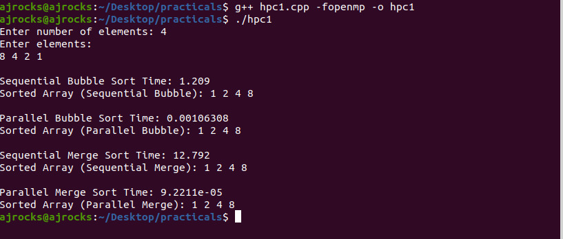
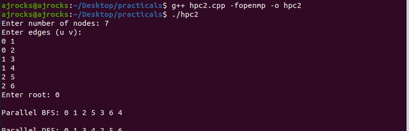
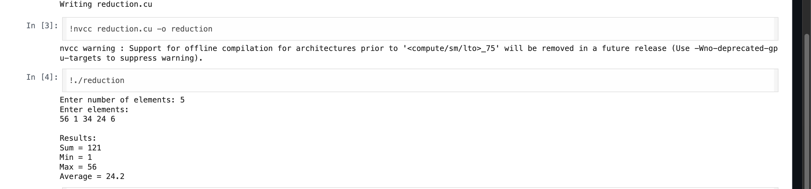
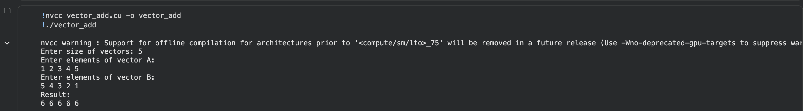
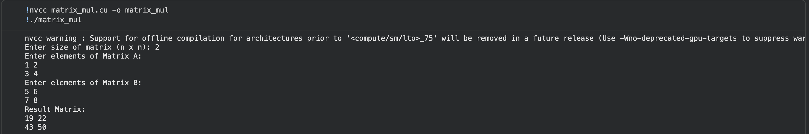

# 🚀 LPV – Parallel Computing Practicals

---

## 🔹 HPC1 – Sorting (Bubble + Merge Sort)

---

## 🔹 HPC2 – Parallel BFS & DFS

---

## 🔹 HPC3 – CUDA SUM, MAX, MIN

---

## 🔹 HPC4 – CUDA Programs

### ➤ Vector Addition

### ➤ Matrix Multiplication

---